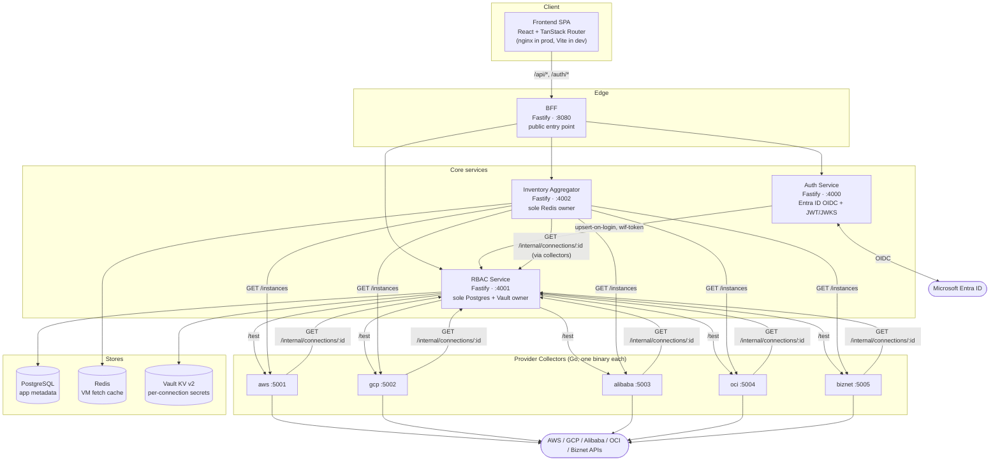
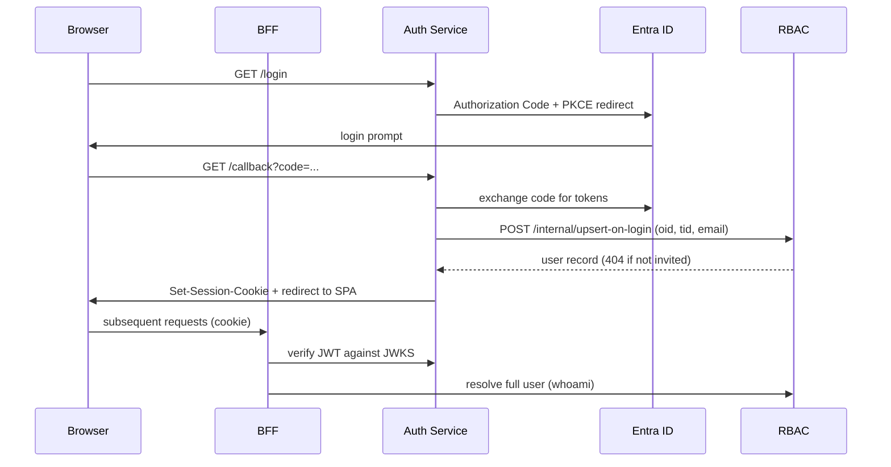
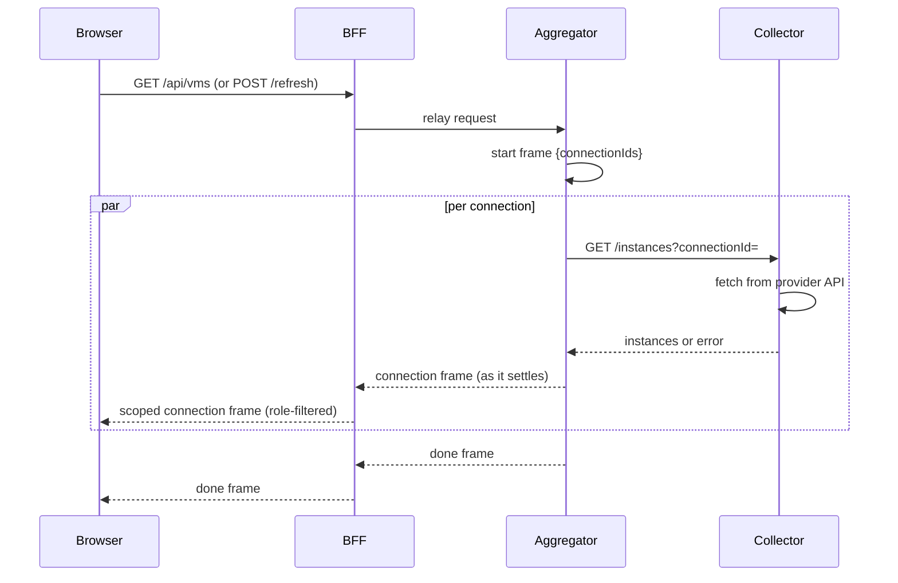

# Cirrus — Architecture

Cirrus is an internal, read-only Cloud VM Inventory Dashboard: it aggregates VM inventory across the company's own accounts on 5 cloud providers (AWS, GCP, Alibaba Cloud, OCI, Biznet Gio Cloud) behind Microsoft Entra ID SSO with two roles (Admin, Viewer).

This document is a **current-state technical reference** — how the system is built today. It intentionally does not repeat:
- **[PRD.md](PRD.md)** — the product source of truth: scope, roles, per-provider credential model rationale, roadmap.
- **[CLAUDE.md](CLAUDE.md)** — the working decision/incident log: bugs found and fixed against real cloud accounts, why specific timeouts/workarounds exist, what's still deferred.

Read this doc first to understand *how the pieces fit together*; read the other two for *why* they're built this way.

## 1. System diagram

## 2. Component reference

### Frontend (`frontend/`)

- **Stack**: React 19 + TypeScript + Vite, TanStack Router (code-based route tree, not a `screen`-state switch), `oxlint`.
- **State**: one hook, `src/state/useCirrusApp.ts`, holds *all* app state/actions (identity, inventory data/filters, connections drawer, add-connection wizard, users drawer, toast). Delivered to components via a plain context, `src/state/AppContext.tsx` (`useApp()`) — required because TanStack Router's injected route `context` only refreshes on navigation, not on state changes.
- **Data**: `src/api/client.ts` — typed fetch wrappers for every BFF route, including NDJSON stream readers for `/api/vms`. No mock data; everything is server-driven (the old role/preview toggles were deliberately removed for this reason).
- **Routing**: `src/router.tsx` — `/` (login, redirects if authenticated) and a protected layout route with `/inventory`, `/connections`, `/connections/new`, `/users` (the latter three admin-gated via `beforeLoad`, mirrored in `Sidebar.tsx`'s nav visibility).
- **Theming**: light/dark via CSS variables in `src/index.css`, persisted to `localStorage` (`cirrus-theme`), applied through `src/theme/`'s `ThemeContext`.
- **Serving**: `frontend/Dockerfile` (multi-stage `node:24-alpine` → `nginx:stable-alpine`); `nginx.conf` proxies `/api`/`/auth` to `bff`, with a dedicated unbuffered route for `/api/vms` streaming. `vite.config.ts` mirrors the same proxy for local dev — both run on port 5173, never simultaneously.

### BFF (`backend/bff/`) — port 8080

The only service reachable from outside the Docker network; proxies/aggregates everything else.

- `plugins/session.ts` — verifies the session cookie JWT against Auth's JWKS, then resolves the full user via RBAC.
- `middleware/requireRole.ts` — `requireAuth`/`requireAdmin` guards.
- `routes/auth.ts` — `GET /auth/me`.
- `routes/connections.ts`, `routes/users.ts`, `routes/providers.ts` — CRUD proxies to RBAC (connections/users admin-only).
- `routes/gcp.ts` — `GET /api/gcp/jwks`, admin-only download of Auth's JWKS for manual upload to Google (GCP WIF setup).
- `routes/vms.ts` — `GET /api/vms`, `POST /api/vms/refresh`: relays the Aggregator's NDJSON stream frame-by-frame, role-scoping each `connection` frame (a Viewer sees an empty `vms` array for connections they're not assigned to).
- `clients/rbacClient.ts`, `clients/aggregatorClient.ts` — internal HTTP clients (shared-secret authenticated).

### Auth Service (`backend/auth/`) — port 4000

Real Microsoft Entra ID OIDC (Authorization Code + PKCE, single-tenant), identity keyed on `oid`+`tid`.

- `oidc/msalClient.ts`, `oidc/callback.ts` — `GET /login` → Entra redirect; `GET /callback` → token exchange (with one retry on transient network errors), calls RBAC's `/internal/upsert-on-login`, mints a session JWT, redirects to the SPA. Every failure mode redirects back to the SPA with `?authError=<code>` rather than returning raw JSON (this is a browser top-level redirect, not a fetch).
- `jwt.ts` — ES256 signing key, `signSession()` (session cookie JWT), `signWifToken()` (short-lived token for GCP Workload Identity Federation), `GET /.well-known/jwks.json`.
- `routes/wif.ts` — `POST /internal/wif-token`, called only by the GCP collector.
- `routes/devLogin.ts` — `GET /dev-login?email=`, gated by `DEV_LOGIN_ENABLED` (default off). Skips the Entra redirect but still calls RBAC's real upsert-on-login, so it can't invite or bypass RBAC — only Microsoft. Temporary, until the real Entra ID app registration exists.

### RBAC Service (`backend/rbac/`) — port 4001

Sole owner of PostgreSQL and the sole Vault client.

- `db/schema.ts` — `users`, `cloudConnections` (config jsonb + `secretRef` pointer into Vault), `userCloudAccounts` (Viewer↔connection assignment), `auditLog`.
- `data/providers.ts` — static per-provider catalog: field definitions (which are secret vs. not), setup guide copy, failure messages.
- `lib/vault.ts` — plain-fetch KV v2 client (`writeSecret`/`readSecret`/`deleteSecret`).
- `lib/collectorClient.ts` — calls a collector's `GET /test` for on-demand connection validation.
- `routes/connections.ts`, `routes/users.ts`, `routes/providers.ts` — CRUD, splitting connection config into Postgres (non-secret) + Vault (secret) on write.
- `routes/internal.ts` — `POST /internal/upsert-on-login`, `POST /internal/audit`, plus the config/whoami/active-connections lookups used internally by BFF, Aggregator, and every collector (`GET /internal/connections/:id` merges the Vault secret back in transparently).

### Inventory Aggregator (`backend/aggregator/`) — port 4002

Sole owner of Redis; fans requests out to the 5 collectors and caches results.

- `cache/lock.ts` — `fetchInstancesCached`: per-`(provider, connectionId)` Redis cache with a `SET NX PX` stampede lock (soft TTL 3 min, hard TTL 15 min, lock TTL 55s). A live-fetch failure by the lock winner falls back to the last-known-good cache entry (tagged with the error) rather than dropping that connection's VMs.
- `fanout.ts` — `fanOutVms(connections, forceRefresh, onResult)`: fans out to all active connections in parallel and invokes `onResult` as each one settles — never waits for the slowest.
- `normalize.ts` — maps a collector's raw `Instance` shape to the wire `Vm` type.
- `routes/vms.ts` — `GET /vms`, `POST /vms/refresh`: streams NDJSON (`start` → one `connection` frame per connection, plus `ping` heartbeats → `done`).

### Provider Collectors (`backend/collectors/`) — a separate Go workspace

`go.work` ties together `internal-kit` (shared, provider-agnostic HTTP envelope + RBAC config-fetch — deliberately zero provider logic) and 5 independent modules/binaries, one per provider. Each exposes the same uniform contract (`GET /instances?connectionId=`, `GET /test?connectionId=`, `GET /healthz`), resolves its own connection config from RBAC, and never lets the Aggregator see credential material.

| Provider | Credential model | Fan-out | `/instances` timeout | `/test` timeout |
|---|---|---|---|---|
| AWS | Static IAM Access Key, per-connection, no role assumption | `errgroup` across every region | 45s (20s/region sub-budget) | 8s |
| Alibaba Cloud | Static RAM User AccessKey, per-connection, no role assumption | `errgroup` across every region (SDK-level timeout, no Go context support) | 30s (15s/region sub-budget) | 6s |
| GCP | Workload Identity Federation — no static secret; exchanges an Auth-Service-signed JWT via Google STS/IAM Credentials | GCP `AggregatedList` (no explicit errgroup) | 15s | 10s |
| OCI | API Signing Key, per-connection; recurses every accessible compartment across every subscribed region | `errgroup` per region × per compartment | 20s | 6s |
| Biznet Gio Cloud | Opaque `x-token` bearer header, plain REST (no official SDK) | `errgroup` across both product lines (NEO Lite / NEO Lite Pro) | 15s | 5s |

Every collector shares the same error taxonomy — `AUTH_FAILED` / `UPSTREAM_ERROR` / `TIMEOUT` — via its own `internal/errors.go` sentinels classified in `main.go`, and the same Dockerfile shape (`golang:1.26-alpine3.23` build → `gcr.io/distroless/static-debian12:nonroot` run).

### Data stores

- **PostgreSQL** — app metadata only, never live VM data: `users`, `cloudConnections`, `userCloudAccounts`, `auditLog` (owned exclusively by RBAC).
- **Redis** — the Aggregator's VM fetch cache, keyed per `(provider, connectionId)` (owned exclusively by the Aggregator).
- **Vault (KV v2, production mode)** — per-connection secret fields only, at `secret/data/cirrus/connections/{id}`, behind a least-privilege `cirrus-rbac` policy. File storage backend (`vault-file` volume) so secrets survive a container restart. RBAC is the only Vault client. Which fields are secret is per-provider: OCI's `privateKey`/`passphrase`, Biznet's `xToken`, AWS's/Alibaba's `secretAccessKey`. GCP has no secret fields at all (WIF needs none); AWS/Alibaba's `accessKeyId` is non-secret.

## 3. Cross-cutting flows

### Auth flow

`DEV_LOGIN_ENABLED` (off by default) lets `GET /dev-login?email=` skip the Entra redirect while still going through the real RBAC upsert — a stand-in for the Microsoft hop only, until the real Entra ID app registration lands.

### VM inventory fetch flow (NDJSON streaming)

Every hop disables buffering end-to-end (`reply.hijack()` + `socket.setNoDelay(true)` at BFF and Aggregator, a dedicated unbuffered nginx location for `/api/vms`) so the browser renders each connection's VMs as soon as it resolves rather than waiting for the slowest of the 5 providers. A `ping` heartbeat frame every 1s keeps intermediary buffering layers flushing during a slow real fetch.

### Error taxonomy → UI

A collector's `{error:{code,message}}` body carries one of `TIMEOUT` / `AUTH_FAILED` / `UPSTREAM_ERROR` all the way to the frontend via each `connection` frame's `error` field (`VmFetchError` in `shared-types`). `OutageBanner.tsx` renders a distinct message per code. If the Aggregator's cache still holds a valid (if stale) entry for a failing connection, that connection's last-known VMs are still returned (flagged via `Vm.stale`, rendered as a `StaleBadge`) rather than disappearing from the table.

### Secret handling

`FieldDef.secret` (`rbac/src/data/providers.ts`) marks which per-provider config fields are secret. On connection create/update, RBAC splits the incoming config: non-secret fields → Postgres `cloudConnections.config` (jsonb), secret fields → Vault at `cirrus/connections/{id}`. `GET /internal/connections/:id` (the endpoint every collector calls) merges both back into one config object transparently — a collector never knows or cares which store a field came from.

## 4. Deployment

Local dev is **Docker Compose only** (`docker-compose.yml` at repo root) — Helm/Kubernetes (PRD §8) is not yet built.

| Service | Image/build | Port | Depends on |
|---|---|---|---|
| postgres | `postgres:17-alpine` | 5432 | — |
| redis | `redis:8-alpine` | 6379 | — |
| vault | `hashicorp/vault:2.0.4` + custom entrypoint | 8200 | — |
| rbac | `./backend`, `rbac/Dockerfile` | 4001 | postgres, vault (healthy) |
| auth | `./backend`, `auth/Dockerfile` | 4000 | rbac |
| collector-aws/gcp/alibaba/oci/biznet | `./backend/collectors`, per-provider Dockerfile | 5001–5005 | rbac (gcp also: auth) |
| aggregator | `./backend`, `aggregator/Dockerfile` | 4002 | redis, rbac, all 5 collectors |
| bff | `./backend`, `bff/Dockerfile` | 8080 | auth, rbac, aggregator |
| frontend | `./frontend/Dockerfile` (nginx) | 5173→80 | bff |

Vault's `entrypoint.sh` runs an idempotent bootstrap on every container start (init once, unseal every time from persisted key shares, enable KV v2, write the `cirrus-rbac` policy, mint RBAC's fixed-ID token) gated by a `bootstrapped` sentinel file that `healthcheck.sh` checks before `rbac` (which `depends_on: vault: condition: service_healthy`) is allowed to start.

No manual migrate/seed step: `rbac`'s entrypoint runs migrations then an idempotent admin-seed on every start.

## 5. Known gaps

See `CLAUDE.md` for full incident-level detail on each of these:

- No periodic connection health-check job (PRD §6.1 recommends every 6h) — `/test` is on-demand only, run manually or from the wizard.
- AWS/Alibaba only cover EC2/ECS compute — e.g. AWS Lightsail VMs are invisible today.
- GCP and Alibaba are unverified against a real successful *instance* fetch (both compile and fail gracefully against real APIs; GCP's lightweight `/test` path is confirmed against a real project).
- Helm charts / Kubernetes deploy path is not built.
